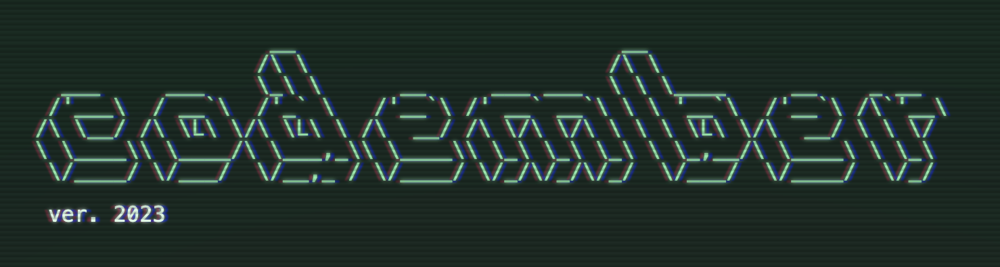

# [codember](https://codember.dev)

Solving challenges and hints to the secrets I found from the game [codember](https://codember.dev/) created by [@midudev](https://github.com/midudev/) for the community.

## Table of challenges

| Challenge |                        Solution                         |
| :-------: | :-----------------------------------------------------: |
|    #01    |    [Scala](challenge_01/src/main/scala/Crypto.scala)    |
|    #02    | [Scala](challenge_02/src/main/scala/MiniCompiler.scala) |
|    #03    |    [Scala](challenge_03/src/main/scala/Cipher.scala)    |
|    #04    |   [Scala](challenge_04/src/main/scala/Checksum.scala)   |
|    #05    |   [Scala](challenge_05/src/main/scala/Database.scala)   |

## Table of secrets

| Secret |         Hints          |
| :----: | :--------------------: |
|  #01   |      pixel image       |
|  #02   |   you have new email   |
|  #03   |      konami code       |
|  #04   | you have another email |
|  #05   |     party command      |
|  #06   |       magic word       |
|  #07   |    sudo pixel image    |
|  #08   |     sudo log file      |
|  #09   |     CHANGELOG.txt      |
|  #10   |        ping url        |
|  #11   | you have another email |
|  #12   | sudo another log file  |
|  #13   |      tetris game       |
